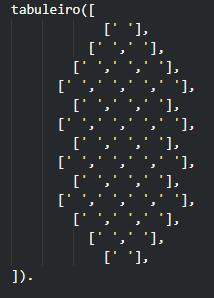
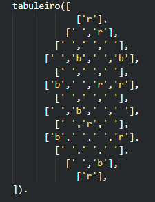
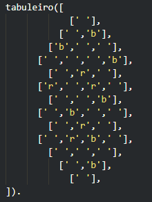

# PLOG_TP1_RI_T2_Gauss4

## Jogo: Gauss

| Name                      | Turma     | Number    | E-Mail               |
| ------------------------- | --------- | --------- | ------------------   |
| Luís Miguel Pinto         |     2     | 201806206 | up201806206@fe.up.pt |
| Nuno Oliveira             |     2     | 201806525 | up201806525@fe.up.pt |

## Descrição do Jogo

Neste jogo cada jogador dispõe de 15 peças (10 da cor dele e 5 da cor do adversário). Um à vez coloca uma peça no tabuleiro que como um íman atrai peças de cor diferente e afasta de cor diferente que já estejam na área de jogo (apenas a mais próxima em cada uma das 6 direções). Se após uma jogada houver 4 ou mais peças adjacentes da mesma cor, o jogador dessa cor recolhe-as e adiciona à área de risco ou bónus consoante estão nas bordas (void) ou não, respetivamente. Quando não houver mais jogadas calcula-se os pontos finais de cada um para descobrir o vencedor.

Página oficial do jogo: https://nestorgames.com/#gauss_detail

Rulebook: https://nestorgames.com/rulebooks/GAUSS_EN.pdf

## Representação Interna do Estado de Jogo

- O tabuleiro de jogo original tem 7 filas com 4 a 7 hexágonos pequenos de maneira a representar um hexágono maior. No entanto, para conseguirmos desenhar o tabuleiro como pretendido em PROLOG teremos de o desenhar na vertical (com 13 filas "intercaladas" cada uma com 1 a 4 hexágonos) o que não altera logística do jogo em si.

- Internamente ' ', 'r' e 'b' representam vazio, peça vermelha e peça azul, respetivamente. 

-  O tabuleiro será iniciado assim: 
>

-  Numa fase intermédia do jogo o tabuleiro estaria num estado idêntico a este: 
>

-  O jogo acaba quando não houver mais peças para jogar e sendo assim o tabuleiro tanto pode estar completamente vazio como com várias peças mas nunca com 4 ou mais da mesma cor adjacentes. 
>

- O jogador atual será guardado como um inteiro que terá o valor de 1 ou 2

- As peças dos dois jogadores serão representadas por um lista com 2 elementos cada um representando quantas peças de cada cor tem e essas duas listas numa outra lista de peças. Ex: [ [ 10, 5 ], [ 10, 5 ] ]

- Peças recolhidas serão guardadas de maneira idêntica à que ainda não foram jogadas só que cada index em vez de representar uma cor, representa área de bónus ou riso.  Ex: [ [ 8, 1 ], [ 5, 0 ] ] 

## Visualização do estado de jogo
O predicado de visualização recebe o estado de jogo e com ele um elemento que começa em 1 e vai sendo iterado para saber qual fila a desenhar. A cada fila remove-se o HEAD da cópia da lista do tabuleiro para se desenhar os valores certos. 

Acima do tabuleiro terá 4 números (2 de cada lado) para representar a quantidade de peças de cada cor dos jogadores.

Novamente dentro do tabuleiro, cada canto será identificado como zona de bónus ou risco de cada jogador e terá um inteiro que vai ser atualizado quando for necessário mover um peça do interior do tabuleiro para lá