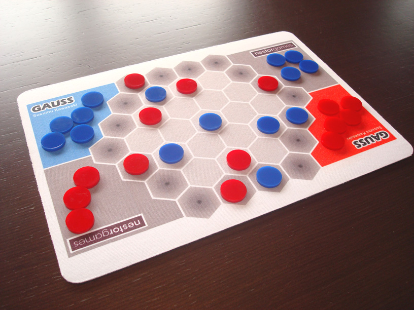
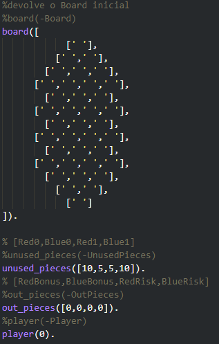
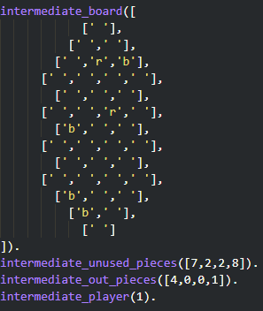
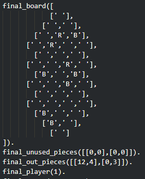
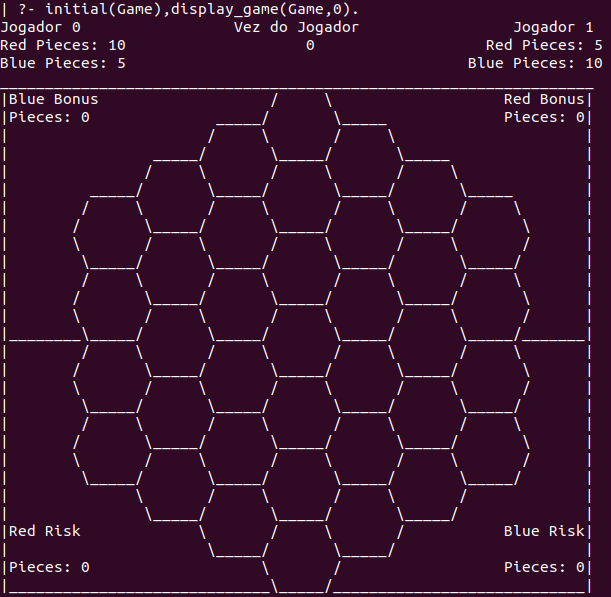
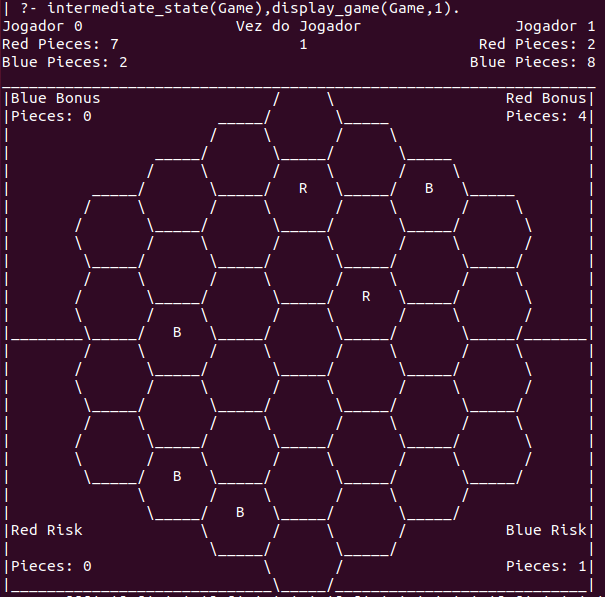
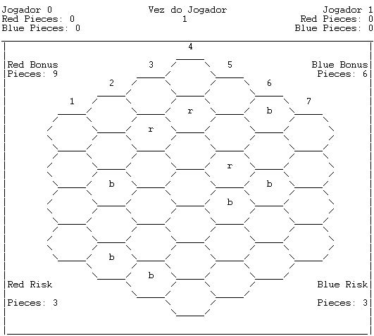

# PLOG_TP1_FINAL_T2_Gauss4

## Jogo: Gauss

| Name                          | Turma     | Numero    | E-Mail               |
| ----------------------------- | --------- | --------- | -------------------- |
| Luís Miguel Afonso Pinto      |     2     | 201806206 | up201806206@fe.up.pt |
| Nuno Filipe Amaral Oliveira   |     2     | 201806525 | up201806525@fe.up.pt |

## Instalação e execução
Para além da instalação do SICStus Prolog 4.6 não é preciso instalar mais nada. Tendo os ficheiros todos com o código fonte é apenas necessário abrir o sicstus pela linha de comandos (sistemas UNIX) ou usando a GUI (sistemas Windows) e consultar o ficheiro 'game.pl' que consulta os restantes ficheiros necessários automaticamente. Para correr o jogo basta chamar o predicado play.

## Descrição do Jogo
O tabuleiro do jogo é hexagonal consistindo de 36 células também elas hexagonais:
>

As bordas do hexágono são mais escuras porque são chamadas de void. Os jogadores não podem colocar peças nestas zonas no entanto as peças podem chegar lá eventualmente devido às mecanicas do jogo quando uma peça é colocada no tabuleiro (explicado mais à frente). De resto, estas zonas não diferem funcionalmente das restantes exceto na recolha de peças pontuadas e no cáculo da pontuação (também explicado mais a baixo).

Cada jogador dispõe também duma zona de bónus, outra de risco para onde vão as peças depois de pontuadas e de 15 peças (10 da cor dele e 5 da cor do adversário). Um à vez os jogadores colocam uma peça da cor que desejarem no tabuleiro que como um íman atrai peças de cor diferente e afasta de cor igual que já estejam na área de jogo até bater noutra peça ou na borda/void (isto afeta apenas a primeira peça em cada uma das 6 direções). 

Se após uma jogada houver 4 ou mais peças adjacentes da mesma cor, o jogador dessa cor tem de as recolher e colocar numa das duas zonas, se a peça estiver num espaço void vai para a zona de risco e caso contrário vai para a zona de bónus. 

Quando não houver mais peças para jogar o jogo acaba e as peças que ficaram no tabuleiro permanecem lá dado que vão ser importantes para calcular as pontuações finais. 

As pontuações são calculadas da seguinte maneira:
- Cada peça na zona bónus vale 1 ponto.
- Se no fim do jogo um jogador tiver mais peças da sua cor na zona void do que o outro este terá de subtrair um ponto por cada peça que tem na zona de risco. 
- Depois destes cálculos feitos, o jogador com mais pontos ganha.
- Em caso de empate é considerado vencedor o jogador com menos peças da sua cor em zonas void.
- Se mesmo assim houver empate é considerado vencedor o jogador com menos peças na zona de risco.
- Se o empate persistir, por improvável que seja, ambos os jogadores são considerados vencedores.

Página oficial do jogo: https://nestorgames.com/#gauss_detail

Rulebook: https://nestorgames.com/rulebooks/GAUSS_EN.pdf

## Lógica do Jogo

### Representação Interna do Estado de Jogo

- O tabuleiro de jogo original tem 7 filas com 4 a 7 hexágonos pequenos de maneira a representar um hexágono maior. No entanto, para conseguirmos desenhar o tabuleiro como pretendido em PROLOG teremos de o desenhar na vertical (com 13 filas "intercaladas" cada uma com 1 a 4 hexágonos) o que não altera logística do jogo em si.

- As peças dos jogadores são representadas por uma lista de duas listas. A primeira lista representa as peças do jogador 0 e a segunda as peças do jogador 1. Cada elemento da lista de um jogador representa o numero de peças não usadas. [[PeçasVermelhas0,PeçasAzuis0],[PeçasVermelhas1,PeçasAzuis1]]

- Peças recolhidas serão guardadas de maneira idêntica às que ainda não foram jogadas só que em vez de jogadores temos área de risco e área de bónus.[[BonusVermelho,BonusAzul],[RiscoVermelho,RiscoAzul]]

- O jogador atual será guardado como um inteiro que terá o valor de 0 ou 1 para indicar o turno.

- O estado de jogo a cada instante é constituído pelo tabuleiro, as peças por jogar, as peças na zona de bónus e risco de cada jogador e finalmente de quem é a vez de colocar uma peça no tabuleiro.

- A dificuldade é obtida com o predicado difficulty que inicialmente tem um valor que não é util mas que é atualizado pelo predicado de escolha de dificuldade. O controlador de cada player (humano ou AI) é utilizado de forma semelhante à diculdade, tendo inicialmente um valor inutil para depois ser atualizado pelo menu de escolha de modo de jogo. Desta maneira podemos usar o mesmo loop para os vários modos de jogo e dificuldades.

- Internamente no tabuleiro '&nbsp;&nbsp;', 'r' e 'b' representam vazio, peça vermelha e peça azul, respetivamente. 

-  O tabuleiro, peças por jogar e peças na zonas de  recolha serão iniciados assim: 
>

-  Numa fase intermédia do jogo espera-se que haja algumas peças na área de jogo, possivelmente algumas nas zonas de recolha e obviamente as lista das peças por jogar terá numeros menores: 
>

-  O jogo acaba quando não houver mais peças para jogar e sendo assim o tabuleiro tanto pode estar completamente vazio como com várias peças. A segunda situação é a mais provavél porque as peças que ficarem na zona void no fim do jogo vão ser importantes para a atribuição dos pontos a cada jogador.
>

### Visualização do Estado de Jogo

Ao executar play, é encontrado um menu inicial que mostra os vários modos e pede ao utilizador que escolha entre eles. Se o modo escolhido tiver envolver que o computador controle um dos jogadores, aparecerá outro menu ainda a perguntar a dificuldade do AI.

>Imagem Do Menu 1
>Imagem Do Menu 2

O predicado responsável pela visualização do estado de jogo a cada instante recebe o tabuleiro, peças por jogar, peças recolhidas, o turno e um elemento extra que começa em 1 e vai sendo iterado para saber qual a fila a desenhar dado que desenhar um tabuleiro com espaços hexagonais com elementos ASCII é relativamente complexo. A cada fila remove-se a HEAD da cópia da lista do tabuleiro para se desenhar os valores certos no tabuleiro. 

Acima do tabuleiro será indicado o número de peças que cada jogador ainda dispõe para jogar. Para além disso, no meio dessa informação será escrito quem é a próxima jogada. 

Novamente dentro do tabuleiro, cada canto será identificado como zona de bónus ou risco de cada jogador e terá um inteiro que representa o número de peças efetivamente nessa zona. Este inteiro será atualizado quando for necessário mover uma peça do interior do tabuleiro para a respetiva zona.

O output deste predicado num estado inicial, intermédio e final seria respetivamente: 

>
>
>

Relativamente à interação com o utilizador esta não é muita visto que só existe para pedir uma jogada ao utilizador quando for relevante e para confirmar as jogadas tanto dele como do computador. 
>Imagem de confirmações

Quanto ao input duma jogada, é primeiro pedido a cor da peça a jogar, que tem de ser obrigatoriamente 'r' ou 'b'. Depois é pedido o numero da coluna onde pretende colocar a peça seguido da linha, a contar de cima, dessa coluna onde o quer fazer. Em cada coluna as linhas começam-se a contar a partir do 1.
>Imagem de Input

### Lista de Jogadas Válidas
A listagem das jogadas válidas é obtida usando o predicado valid_moves(+GameState, +Player, -ListOfMoves) recebendo um GameState e o Player para o qual deve listar as jogadas válidas unificando-as com ListOfMoves. Recorrendo um predicado ao auxiliar check_line([H|T], Row, List) que recursivamente percorre todas as células do board vai-se obter em List todas as células do tabuleiro que estão desocupadas e fora da zona void. De seguida, com a lista obtida vai-se criar outras duas que contêm as mesmas jogadas mas com as cores das peças adicionadas se tiverem disponiveis. Se uma cor não estiver disponível os predicados checkForRed/4 e checkForBlue/4 constroem uma lista vazia. No fim o ListOfMoves será o append das duas listas obtidas. Um extra que decidimos colocar foi dar random sort da lista final por causa do AI que, como vai ser explicado na secção "Jogada do Computador", escolhe a jogada com base no valor do tabuleiro e se houvesse várias com a mesma pontuação, escolheria sempre a primeira. Desta maneira, evitamos esse problema.
 
### Execução de Jogadas
A uma jogada é validada e executada maioritariamente pelo predicado move(+GameState,+Move,-NewGameState). Primeiramente, no loop principal é identificado o controlador do jogador (humano ou computador) que tem a vez e é lhe pedido o input.

Obtida a jogada, esta é passada ao predicado move, juntamente com o GameState para que este a valide e execute. De seguida, verifica se o jogador em questão ainda tem peças da cor que pretende jogar recorrendo ao predicado verifyAvailablePiece(UnusedPieces,Player,Colour). Se tal se confirmar, testa se a célula escolhida está realmente vazia, coloca lá a peça, devolve um board atualizado e utilizando removeFromUnused(UnusedPieces,Player,Colour,NewUnusedPieces) obtem um UnusedPieces atualizado em NewUnusedPieces. 

A primeira coisa a fazer após a peça ser colocada será então percorrer o tabuleiro em cada uma das seis direções a partir da célula recentemente ocupada até encontrar uma outra peça para atraí-la ou afastá-la dependendo da sua cor. Isto é feito recorrendo ao predicado move_dir(Board, GetDirPosFunc, GetOposDirFunc, Color, XI, YI, NewBoard) que precisa de receber muitos elementos para que não seja necessário criar um predicado diferente para cada direção:
 - Board - tabuleiro a pesquisar
 - GetDirPosFunc - o nome do predicado que, a partir de uma posição, obtém a próxima posição na direção desejada
 - GetOposDirFunc - o nome do predicado que, a partir de uma posição, obtém a próxima posição na direção oposta à desejada
 - Color - cor da peça colocada pelo jogador
 - XI e YI -  coordenadas da célula onde foi colocada a peça
 - NewBoard que vai conter o tabuleiro resultante

Este move_dir recorre também a alguns predicados auxiliares como check_dir, apply_move_dir, get_void_dir e move_piece. Inicialmente, move_dir, a partir da posição que recebe, obtém a proxima posição na direção em GetDirPosFunc e usa check_dir para procurar pela peça mais próxima também nessa direção. Se check_dir encontrar uma peça, a posição da mesma é retornada nos elementos XO e YO e a cor em PieceO. Se não encontrar, significa que não é necessário mover peça nenhuma pelo que o predicado falha e move_dir limita-se a copiar o Board para o NewBoard. No entanto, se realmente encontrar uma peça, o apply_move_dir é responsável por identificar o que tem que fazer tendo em conta as cores das peças (afastar/atrair) e usar move_piece (move a peça duma célula para outra) para mover a peça duma célula para outra.

Tendo isto tudo feito em cada uma das 6 direções falta verificar se há 4 ou mais peças adjacentes da mesma cor para que sejam removidas da área de jogo para as devidas zonas. Para tal vamos usar o predicado search_board que percorre o tabuleiro até encontrar uma peça. Depois de encontrada, o search_near recursivamente (search_near chama add_to_list e add_to_list chama search_near) pesquisa as 6 células adjacentes que contenham uma peça da mesma cor e guarda-as na base de dados. Feito isto, com o setof obtêm-se uma lista com todas as células guardadas e se tiver um tamanho maior do que 4, são todas removidas do tabuleiro no predicado remove_pieces. No fim, o search board procura novamente por outra peça e repete o processo até chegar ao fim do tabuleiro.

Finalmente, só falta mudar o turno do jogador com change_turn/2 e criar um novo GameState com as informações todas atualizadas.

### Final do Jogo
Ainda que este jogo em particular tenha sempre 30 jogadas, o final do jogo é testado a cada jogada usando o predicado game_over(+GameState, -Winner) que vê se ainda existem peças por jogar ou não. Se o jogo tiver realmente terminado, ainda no predicado game_over, usando get_number_void é obtido o número de peças nas zonas void que cada jogador tem para se passar ao cálculo efetivo das pontuações (como explicado na descrição do jogo) e obter o vencedor com get_points e get_winner, respetivamente.

### Avaliação do Tabuleiro
Dado um estado de jogo, o predicado ​value(+GameState, +Player, -Value) determina o valor dele da mesma maneira que o predicado de final de jogo o faz. A diferença é que nesta não obtemos um vencedor com as pontuações obtidas, em vez disso, unificamos Value com a diferença das pontuações entre o Player em questão e o outro.

### Jogada do Computador
O predicado choose_move(+GameState, +Player, +Level, -Move) é responsável por escolher a jogada do computador conforme a dificuldade do AI que é passado em Level (easy ou hard). 

Se a dificuldade for easy implica que cada jogada será obtida de forma aleatória. Assim primeiro é necessário obter a listagem de jogadas válidas usando valid_moves e recorrendo ao predicado random_member da biblioteca random escolhe-se uma dessas jogadas para se efetuar.

No entanto, se dificuldade for hard, são obtidas e aplicadas todas as jogadas válidas ao GameState atual para ter todos os GameStates possíveis usando getStates. Depois com o predicado getMaxSons itera-se por todos os GameStates recolhidos à procura do que tem mais valor para o player em questão e é esse que será no fim escolhido como jogada.

Um problema que tinhamos inicialmente com esta dificuldade foi o facto de, caso houvesse jogadas com a mesma pontuação, escolhia sempre a primeira na lista o que tornaria os jogos muito repetitivos (principalmente no modo Computer vs Computer onde os jogos seriam literalmente sempre iguais). Para circundar esta situação decidimos dar random sort na listagem das jogadas válidas. Desta maneiras garantimos uma certa aleatoriedade relativamente à jogada escolhida ainda que seja sempre uma das que tem maior pontuação.

## Conclusão
Devido à estrutura hexagonal do tabuleiro e às mecanicas do jogo tivemos algumas dificuldades nos aspetos de manipulação do board como, por exemplo, a percorrer o mesmo. O que ainda dificultou mais o processo inicialmente foi o facto de as coordenadas duma célula que o jogador vê são completamente diferentes das coordenadas internas do tabuleiro pelo que tivemos mapear posições internas para externas no board_map.pl e trabalhar constantemente com as 2 posições.

Outro "problema" que tivemos com a estrutura do tabuleiro foi a identificação duma célula para que o utilizador a escolhesse para uma jogada. Foi-nos sugerido que colocássemos a identificação dentro da própria célula mas depois de experimentar-mos tornou o tabuleiro muito condensado e difícil de ler o que nos levou a deixar apenas a identificação das colunas e pedir o input fazendo a contagem de cima para baixo.

Como em todos os programas, há aspetos do nosso trabalho que podiam ser melhorados, como por exemplo, acrescentar outro nível de dificuldade que verifica a melhor jogada com maior profundidade em vez de a escolher de modo "greedy". Outro aspeto que podiamos melhorar é o facto do move fazer verificações inuteis quando o controlador do player é o computador dado que o obtém a jogada a partir do valid_moves.

Concluindo, pensamos que cumprimos todos os objetivos deste trabalho prático nomeadamente implementar o jogo na sua totalidade e no processo adquirir um maior entendimento da linguagem de programação lógica Prolog.

## Bibliografia
Página oficial do jogo
- https://nestorgames.com/#gauss_detail

Rulebook
- https://nestorgames.com/rulebooks/GAUSS_EN.pdf

SICStus Prolog User’s Manual
- https://sicstus.sics.se/sicstus/docs/latest4/pdf/sicstus.pdf